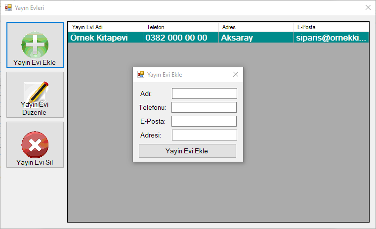

# Library Tracking System

The library tracking system I made during my university years.

## Used technologies
- C#
- Sqlite

## Specifications
- No installation required, portable program and database.
- Lending books to registered members until a certain date.
- For books that are not returned on time, the member will be fined.

## Screenshots

##### Login

##### Main Panel

##### Lends

##### Fines

##### Members

##### Books

##### Publishing Houses

##### Authors

##### Categories

##### Settings
